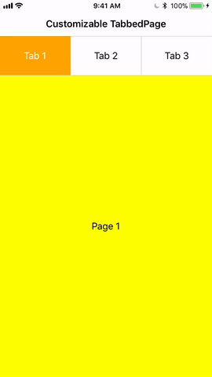

# STabbedPage.Forms

Full customizable TabbedPage control for Xamarin.Forms.

[](https://www.nuget.org/packages/STabbedPage.Forms/)

Supports Android and iOS.

## Screen-Shots

 

## Setup

* Install the [nuget package](https://www.nuget.org/packages/STabbedPage.Forms) in portable and all platform specific projects.

### Android

In MainActivity.cs file

```cs
    Stormlion.STabbedPage.Droid.Platform.Init(this);
```

### iOS

In AppDelegate.cs file

```cs
    Stormlion.STabbedPage.iOS.Platform.Init();
```
## Usage

```xaml
	<?xml version="1.0" encoding="utf-8" ?>
	<stab:STabbedPage xmlns="http://xamarin.com/schemas/2014/forms"
					  xmlns:x="http://schemas.microsoft.com/winfx/2009/xaml"
					  xmlns:stab="clr-namespace:Stormlion.STabbedPage;assembly=Stormlion.STabbedPage"
					  Title="Customizable TabbedPage"
					  x:Class="Test.TabbedPage1"
					  TabBarPosition="Top"
					  TopBarHeight="0"
					  >
		<stab:STabbedPage.TabBarCellTemplate>
			<DataTemplate>
				<Grid BackgroundColor="White">
					<Label Text="{Binding Title}"
						   HorizontalTextAlignment="Center"
						   VerticalTextAlignment="Center"
						   />
				</Grid>
			</DataTemplate>
		</stab:STabbedPage.TabBarCellTemplate>
		<stab:STabbedPage.TabBarSelectedCellTemplate>
			<DataTemplate>
				<Grid BackgroundColor="Orange">
					<Label Text="{Binding Title}"
						   HorizontalTextAlignment="Center"
						   VerticalTextAlignment="Center"
						   TextColor="White"
						   />
				</Grid>
			</DataTemplate>
		</stab:STabbedPage.TabBarSelectedCellTemplate>
		<ContentPage Title="Tab 1"
					 BackgroundColor="Yellow"
					 >
			<ContentPage.Content>
				<StackLayout>
					<Label Text="Page 1"
						   VerticalOptions="CenterAndExpand" 
						   HorizontalOptions="CenterAndExpand"
						   />
				</StackLayout>
			</ContentPage.Content>
		</ContentPage>
		<ContentPage Title="Tab 2"
					 BackgroundColor="LightGreen"
					 >
			<ContentPage.Content>
				<StackLayout>
					<Label Text="Page 2"
						   VerticalOptions="CenterAndExpand" 
						   HorizontalOptions="CenterAndExpand"
						   />
				</StackLayout>
			</ContentPage.Content>
		</ContentPage>
		<ContentPage Title="Tab 3"
					 BackgroundColor="LightBlue"
					 >
			<ContentPage.Content>
				<StackLayout>
					<Label Text="Page 3"
						   VerticalOptions="CenterAndExpand" 
						   HorizontalOptions="CenterAndExpand"
						   />
				</StackLayout>
			</ContentPage.Content>
		</ContentPage>
	</stab:STabbedPage>
```

### Properties
* TabBarPosition ( Top or Bottom )
* TabBarCellTemplate
* TabBarSelectedCellTemplate
* TabBarHeight
* SplitterColor and SplitterWidth
* TopBarColor and TopBarHeight
* BottomBarColor and BottomBarHeight

## Contributions
Contributions are welcome!

## Contributors
* **[Marko Rothstein](https://www.facebook.com/profile.php?id=100014026622428)**


## Donation
If this project help you reduce time to develop, you can give me a cup of coffee :)

[](https://www.paypal.com/cgi-bin/webscr?cmd=_donations&business=stormlion227@gmail.com&item_name=Donate+to+free+developer)
